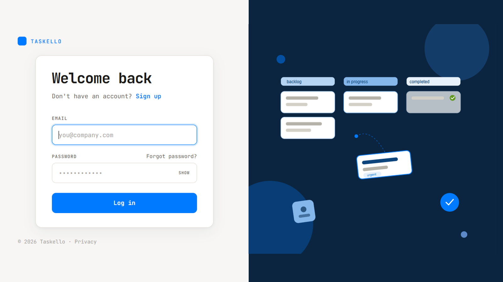
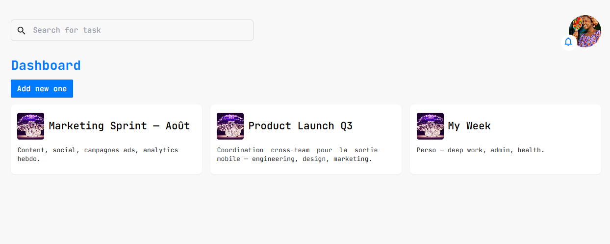
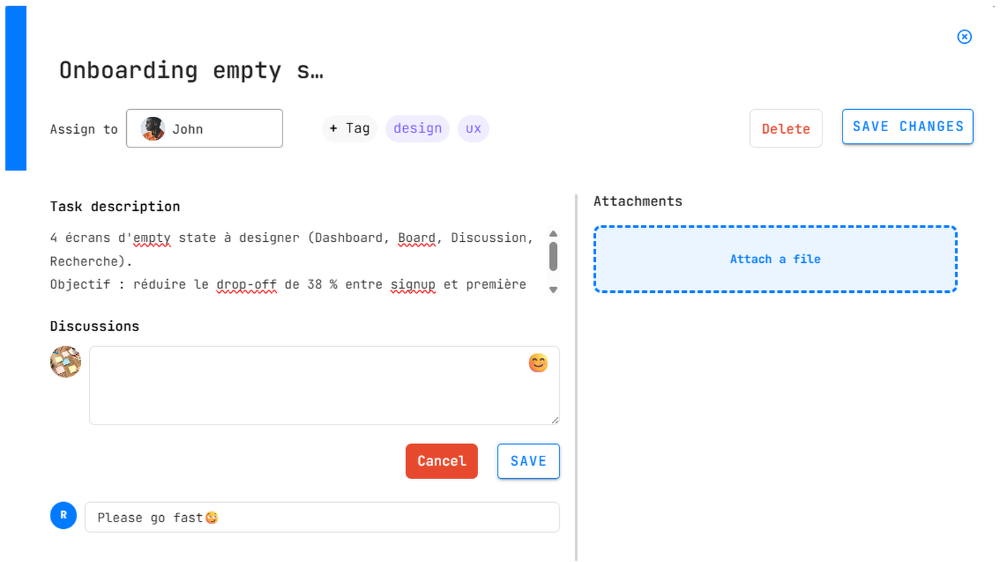
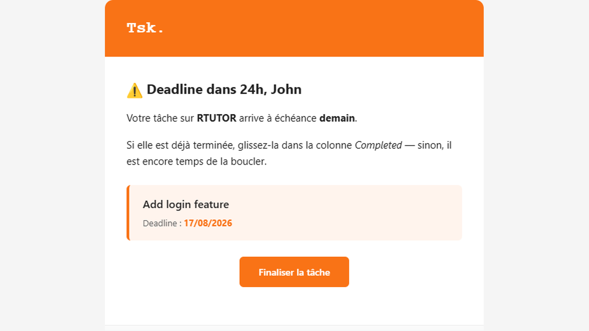

# Taskello — Frontend

A Trello-inspired task management application built with **Vue 3**, **Vite**, **Vuetify 3**, and **Tailwind CSS**.
Users create dashboards, organise work into columns (Kanban), assign tasks to teammates, and receive automated email reminders as deadlines approach.

Backend companion repo: **[task-management-app](https://github.com/Tchobo/task-management-app)** (Django + DRF + Celery + Redis).

---

## Screenshots

### Login
Two-column layout: brand + form card centered on the left, full-height Kanban illustration on the right. Card layout collapses to a form-only view below 960 px.



### Your dashboards
Landing view after sign-in — search bar, "Add new one" CTA, and one card per dashboard (title + description). Click any card to open its Kanban board.



### Task detail
Modal with title, assignee picker, tags, rich-text description, threaded discussion, and file attachments zone. Only the task creator sees the **Delete** button.



### Email reminders
One of four escalating HTML templates the backend sends hourly based on `assigned_at` vs `deadline`. The example below is the **Near deadline** variant (orange, fires when < 48 h remain). The full palette progresses:

| Template | Color | Trigger |
|----------|-------|---------|
| Not started | Blue `#007AFF` | Long horizon, no activity |
| Mid-term | Amber `#F59E0B` | Halfway through the window |
| **Near deadline** | Orange `#F97316` | < 48 h remaining |
| Overdue | Red `#DC2626` | Deadline passed, not completed |



---

## Features

- **Multi-dashboard workspace** — organise projects into independent boards.
- **Kanban columns** — configurable per dashboard, with drag-and-drop reordering (fractional indexing + rebalance safety).
- **Task management** — title, description (rich-text via CKEditor), tags, image thumbnail, files, deadline, comments, assignee.
- **Assignee flow** — assign any active user; only the creator can delete a task; assignees see the task on their own dashboards.
- **Live-sync** — the board polls every 20 s while the tab is visible, so multiple users editing in parallel stay in sync (comment counts, moves between columns, new tasks).
- **Real avatars everywhere** — cards, comment threads, and the assignee picker all render the user's actual profile image (fallback to initial on primary blue).
- **Email reminders** — the backend fires four escalating templates depending on `assigned_at` vs `deadline` (see backend README for the scheduling rules).
- **Responsive** — grid collapses to a single column below 960 px.

---

## Tech stack

| Layer             | Tooling                                          |
|-------------------|--------------------------------------------------|
| Framework         | Vue 3 (Composition API, `<script setup>`)        |
| Build             | Vite 5                                           |
| UI kit            | Vuetify 3                                        |
| Utility CSS       | Tailwind CSS 3                                   |
| State             | Vuex 4 (imported directly — no `app.use(store)`) |
| Routing           | Vue Router 4                                     |
| HTTP              | Axios                                            |
| Drag-and-drop     | Vuedraggable / SortableJS                        |
| Rich-text editor  | CKEditor 5 (Classic build)                       |
| Icons             | FontAwesome, Vue Material Design Icons, Heroicons|

---

## Getting started

### Prerequisites

- **Node.js ≥ 18**
- The backend running locally on `http://127.0.0.1:8080` (see [backend README](https://github.com/Tchobo/task-management-app)).

### Install & run

```bash
git clone https://github.com/Tchobo/task-managment-front.git
cd task-managment-front
npm install
npm run dev
```

Open [http://localhost:5173](http://localhost:5173) (Vite's default port).

### Backend URL

The API base URL is currently hardcoded in [src/helpers/api-call.js](src/helpers/api-call.js):

```js
export const apiUrl = "http://127.0.0.1:8080"; // Test local
```

Swap the value for your staging / prod host when needed.

### Build for production

```bash
npm run build     # outputs to dist/
npm run preview   # serves the built bundle locally
```

---

## Project structure

```
src/
├── assets/            # images, illustrations
├── components/        # reusable pieces (TaskComponent, TaskCategory, Modal, DebugPanel...)
├── helpers/           # api-call.js — axios wrapper + shared apiUrl
├── router/            # Vue Router setup
├── store/             # Vuex — state, mutations, actions
└── views/             # page-level views (Login, Task, Dashboard, Notification...)
```

Notable convention: **`import store from "../store"`** everywhere — the store is *not* registered via `app.use(store)` in `main.js`, so `useStore()` returns `undefined`. Direct import is the canonical pattern in this project.

---

## Contributing

1. Fork the repo.
2. Create a feature branch: `git checkout -b feat/short-name`.
3. Commit with **Conventional Commits** (`feat(scope): …`, `fix(scope): …`).
4. Push and open a PR against `main` with a clear description and screenshots for UI changes.

---

## License

Private — internal use.
